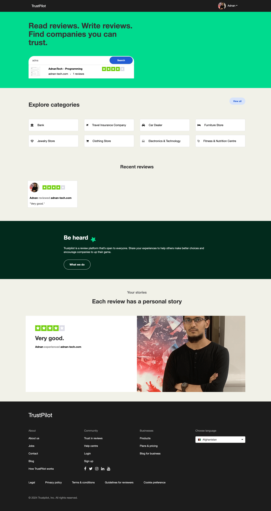

# TrustPilot clone - Node JS and Mongo DB

A clone of TrustPilot website is created in Node JS and Mongo DB. I am using Node JS version 20 and Mongo DB version 4+

## Screenshot



## Installation

Download and Install Node JS and Mongo DB

### Run Mongo DB

- Start Mongo DB server by running the following command in "bin" folder where Mongo DB is installed:

```
./mongod
```
or
```
mongod
```

### Run Node JS

Then open command prompt in this folder and run the following command:
```
npm update
npm install -g nodemon
nodemon index.js
```

### Project URL:
Then open your browser and enter the following address:
http://localhost:4000/

### For any help or suggestion:
https://adnan-tech.com